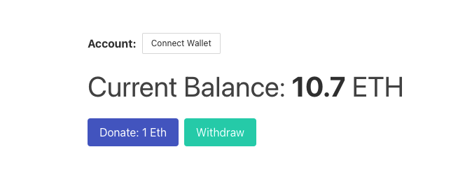

# Faucet

## Repository for learning solidity and deploying smartcontracts on the Ethereum blockchain. 

The web app uses ganache as a personal blockchain and is integrated with metamask. Users are allowed to connect a wallet in the browser to display a balance and add / withdraw funds.

  

